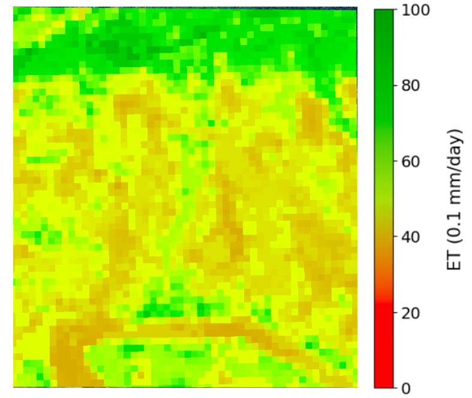
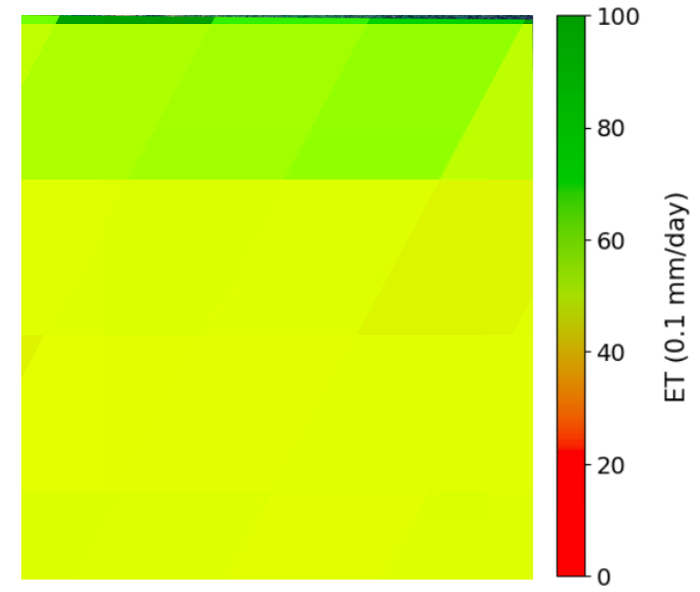

# Scalable ML-Based Approach for Downscaling ET

### Overview

This repository contains the scripts containing the source code for the paper titled "Initial Experiments with a Scalable Machine Learning Based Approach for Downscaling the MOD16A2 Evapotranspiration Product". The paper is authored by:
1. Vatsal Jingar (Indian Institute of Technology, Delhi) <cs5200449@cse.iitd.ac.in>
2. Stitiprajna Sahoo (Indian Institute of Technology, Delhi) <cs1200394@cse.iitd.ac.in>
3. Dharmisha Sharma (Indian Institute of Technology, Delhi) <mcs222062@cse.iitd.ac.in>
4. Siddharth S (Indian Institute of Technology, Delhi) <mcs222061@cse.iitd.ac.in>
5. Shivani A Mehta (Indian Institute of Technology, Delhi) <Shivani.A.Mehta@sit.iitd.ac.in>
6. Aaditeshwar Seth (Indian Institute of Technology, Delhi) <aseth@cse.iitd.ac.in>

and would be published in ACM COMPASS 2024 on July 8-11, 2024. The main objective of the paper is to contribute a scalable and adaptable solution to address the growing demand for fine-resolution Evapotranspiration data. The paper makes the following contributions:
* Implementation of a Random Forest model that can output the downscaled ET at a scale of 30m across all regions of India in Google Earth Engine, which makes it scalable for extensive utilisation for ecological and hydrological models.
* Visualization of the downscaled ET output using GEE’s visualization tools can help in spatial and temporal analysis of trends of ET at the region of interest.

The implementation details are provided in the paper

### Repository Structure

The repository is organized as follows:

```
├── scripts/  
|  ├── Downscaling/              
│ | ├── DataExtraction/   
| |  |   ├── ExportTrainingDatatoDrive.js    # It exports the input features and ET values in form of CSV file
| |  |   ├── InferenceETfromModelAsset.js    # It imports the trained model from assets and produces downscaled ET
| |  |   ├── TrainTileUploadAsset.js         # It exports the training regions (tiles) as asset
│ |  ├── ModelTraining/ 
| |  |   ├── modelTrain&Upload.ipynb         # It uses the exported training data to train the model, and uploads the trained model as an GEE asset
|  ├── Calibration/ 
└── Readme.md             
```

### Results 

All results of different experiments performed to validate the downscaling model has been mentioned in the paper. The model outputs ET at a resolution of 30 meter, by being trained on the MODIS ET as output which is at resolution of 500 meter.


This is a snapshot of the satellite image of the region 

 

This is the downscaled ET produced by the model at scale of 30m



This is the MOD16A2 ET product for the region at scale of 500m

